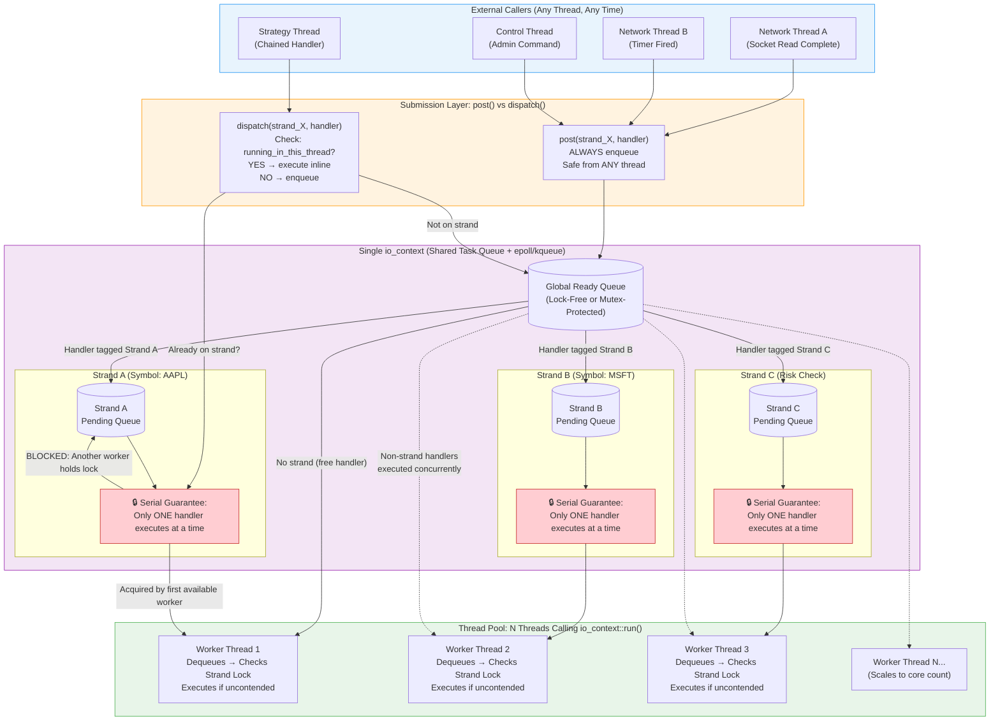

## Mental picture on the common scenario - 1 `io_context`, many caller threads, many strands, many runners.
Here is a comprehensive mental model of a single `io_context` with multiple threads and strands. This diagram captures both the **submission path** (how work gets in) and the **execution path** (how work runs safely).



### How to Read This Diagram as a Mental Reference

#### Left → Right: The Lifecycle of a Handler
1.  **Any thread** calls `post()` or `dispatch()` targeting a specific strand
2.  Work enters the **global queue** (or executes inline for `dispatch` when already local)
3.  A **worker thread** dequeues it and attempts to acquire the strand's serial lock
4.  If acquired → handler runs; all other handlers for that strand **wait in the strand's pending queue**
5.  When done → next pending handler for that strand is promoted

#### Key Invariants to Memorize

| Invariant | What It Means Visually |
| :--- | :--- |
| **Strand = Serial, Not Sticky** | Strand A's handlers always run one-at-a-time, but **any** worker thread can execute them. Thread 1 might run AAPL tick #1, Thread 3 might run AAPL tick #2. Never assume thread affinity. |
| **Different Strands = True Parallelism** | Strand A and Strand B handlers **can and will** run simultaneously on different workers. This is your throughput. |
| **Non-Strand Handlers = Fully Concurrent** | Handlers posted without a strand bypass all locks. Use only for stateless or externally synchronized work. |
| **`dispatch` Shortcut** | The orange box shows the fast path: if Worker Thread 2 is *already* executing a Strand B handler and calls `dispatch(strand_B, ...)`, it skips the global queue entirely and runs inline. This is the latency optimization. |
| **Global Queue ≠ Strand Queue** | Two levels of queuing exist. The global queue distributes work to threads; strand queues enforce ordering *within* a logical domain. Contention at either level causes latency. |

#### Common Misconception This Diagram Corrects
> ❌ "A strand is bound to a specific thread."
> ✅ A strand is a **logical serialization guarantee**. The physical thread that executes it changes dynamically based on which worker is free. If you need true thread affinity (e.g., for CPU pinning), use a **dedicated single-threaded `io_context`** instead of a strand.

Save this diagram. Whenever you reason about Asio concurrency, trace a handler through these four layers: **Caller → Submission → Queue/Strand → Worker**.

---
## Question: More on `post` and `dispatch` please? I still don't see why and in which scenarios we need `post`.

It is completely normal to feel like `post` is redundant. In 90% of trading code, `dispatch` is indeed the correct choice.

However, `post` exists to solve three specific problems where **executing immediately is actually a bug or a performance hazard**. Here are the exact scenarios where you *must* use `post`:

### 1. Breaking Infinite Recursion / Stack Overflow
This is the most common reason in event-driven systems. Imagine a handler that conditionally triggers itself:

```cpp
void on_order_ack(const Ack& ack) {
    if (ack.status == PENDING) {
        // ❌ DISPATCH: Executes inline → calls on_order_ack again → 
        //    dispatch executes inline → infinite recursion → STACK OVERFLOW
        asio::dispatch(strand_, [this]{ on_order_ack(last_ack_); });
        
        // ✅ POST: Enqueues and RETURNS immediately.
        //    Current stack unwinds. Next iteration runs on a fresh stack frame.
        asio::post(strand_, [this]{ on_order_ack(last_ack_); });
    }
}
```

`dispatch` will keep calling inline as long as you're on the same strand. If your logic has any possibility of self-referential triggering (directly or through a chain A→B→A), `post` acts as a **stack breaker**.

### 2. Fairness / Preventing Starvation
When you're already on a strand, `dispatch` gives the new handler **priority over everything else in the strand's queue**. This can starve other work:

```cpp
void process_tick(const Tick& t) {
    update_price(t);
    
    // ❌ DISPATCH: This logging handler jumps ahead of ALL pending ticks
    //    in the strand queue. During high volatility, logs monopolize
    //    the strand and tick processing falls behind.
    asio::dispatch(strand_, [this]{ flush_log_buffer(); });
    
    // ✅ POST: Logging goes to the BACK of the strand queue.
    //    All pending ticks are processed first. Fair scheduling.
    asio::post(strand_, [this]{ flush_log_buffer(); });
}
```

**Rule of thumb:** If the new work is *lower priority* than work already queued on the strand, use `post`. `dispatch` implicitly says "this is a continuation of current work and should not be delayed."

### 3. Re-Entrancy Protection / Deferring Side Effects
Sometimes executing inline violates an API contract or invariant:

```cpp
void cancel_all_orders() {
    is_cancelling_ = true;
    
    for (auto& order : active_orders_) {
        // ❌ DISPATCH: send_cancel() might synchronously trigger 
        //    on_cancel_ack() which checks is_cancelling_ and modifies
        //    active_orders_ WHILE WE'RE ITERATING IT → UB / corrupted container
        asio::dispatch(strand_, [&order]{ send_cancel(order); });
        
        // ✅ POST: send_cancel() is deferred. Loop completes safely.
        //    Cancel acks arrive after iteration is done.
        asio::post(strand_, [&order]{ send_cancel(order); });
    }
    
    is_cancelling_ = false;
}
```

This pattern appears whenever you:
-   Iterate a container and trigger operations that modify it
-   Call user-supplied callbacks that might call back into your API
-   Change state flags that guards depend on being stable during the current scope

### Decision Flowchart

Use this as your mental checklist every time you schedule work on a strand:

```
Need to schedule handler on strand?
│
├─ Could this cause recursion or unbounded chaining?
│   YES → post()
│   NO ↓
│
├─ Is this work LOWER priority than already-queued handlers?
│   YES → post()
│   NO ↓
│
├─ Would inline execution violate re-entrancy / iterator / state invariants?
│   YES → post()
│   NO ↓
│
└─ DEFAULT → dispatch()
     (Safe from any thread, zero overhead when local)
```

### Summary Table for Quick Reference

| Scenario | Use | Why |
| :--- | :--- | :--- |
| Normal async chain continuation | `dispatch` | Zero-latency when already local |
| Cross-thread handoff (network → strategy) | `dispatch` | Safe + fast when accidentally local |
| Self-referential / recursive trigger | `post` | Prevents stack overflow |
| Lower-priority background work (logging, metrics) | `post` | Prevents starvation of hot-path work |
| Triggering side effects during iteration/state transition | `post` | Prevents re-entrancy bugs |
| Intentionally yielding to let other strands run | `post` | Cooperative multitasking |
| Breaking up long computation into chunks | `post` | Keeps strand responsive |

> 💡 **The core insight:** `dispatch` means **"do this as soon as possible, ideally now."** `post` means **"do this later, after current work yields."** The distinction is about *scheduling semantics*, not just thread safety. Thread safety is handled by the strand regardless of which you choose.

In practice, if you find yourself reaching for `post` frequently, it often signals that your strand is doing too much and should be split. But when you need it, it is irreplaceable.
